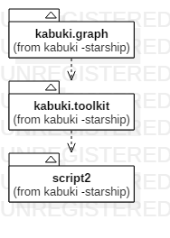

# [KabukiPress Cookbook](../readme.md)

## [Introduction](./readme.md)

### Organization

Script2 and Kabuki Toolkit are organized is a minimalist modular format where the code is in the root folder. This book focuses on Kabuki Graph, which is a graphing calculator built with Kabuki Toolkit and Eigen. There is also a KabukiPress Cookbook for learning to make websites, and a Kabuki Theater Cookbook for learning to make 2D and 3D games.

#### Project File Structure

* kabuki.graph
  * `main.cpp`, as usual, contains the entry point to the application.
  * `module.inl` `#includes` all of the `.inl` inline implementation files into one translation unit.
  * 

**[<< Previous Section:Kabuki Toolkit](./kabuki_toolkit.md) | [Next Section:Summary >>](../summary.md)**

## License

Copyright 2018-9 (C) [Cale McCollough](https://calemccollough.github.io); all rights reserved (R).

This is an open-source document, the Document, that was written by and contains intellectual property. The Document consists of documents, files, source code, technology design files, art, and other content contained this file, folder and markdown.cookbook GitHub repository located at <https://github.com/kabuki-starship/kabuki.press.cookbook>, the Repository. The Document is published under a generic non-commercial open-source license, the License, and is for educational and demonstration purposes only. You may use, reproduce, publicly display, and modify the Document so long as you submit and donate fixes and derived intellectual property, the Donated Ideas, to the Repository as an Issue ticket to become part of the Document. You may not sell the Document or otherwise profit from derivative works created from the Document without the expressed written permission of Your Name. Unless required by applicable law or agreed to in writing, the Document distributed under the License is distributed on an "AS IS" BASIS, WITHOUT WARRANTIES OR CONDITIONS OF ANY KIND, either express or implied.
